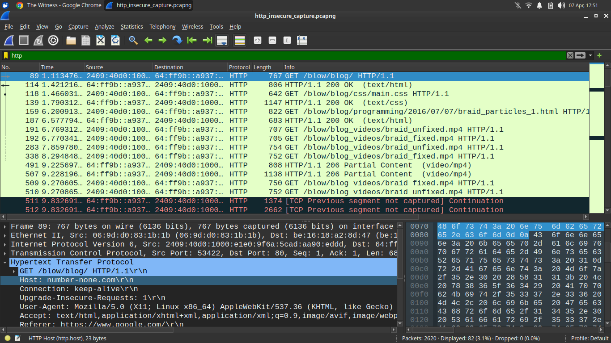
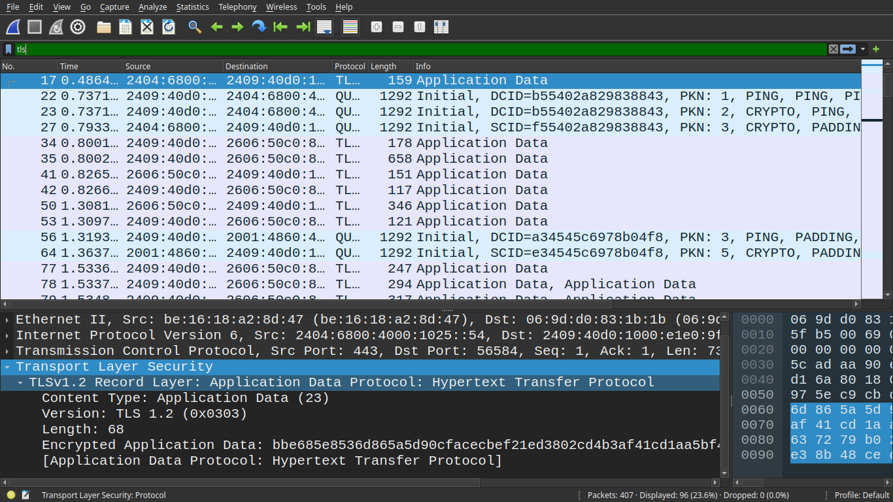

# Network Protocol Analysis: HTTP vs HTTPS 

## 📌 Project Overview
This project demonstrates the critical security differences between HTTP and HTTPS protocols through live network traffic analysis. By capturing and inspecting packets using Wireshark, this repository highlights why unencrypted web traffic is vulnerable to interception and how TLS secures modern web communications.

## 🛠 Tools & Environment
* **Packet Analyzer:** Wireshark
* **Operating System:** Linux
* **Target Traffic:** Live web browsing sessions

## 🔍 Methodology & Analysis

### 1. HTTP Analysis (Insecure)
To analyze unencrypted traffic, a packet capture was executed while navigating to `http://number-none.com`.

* **Wireshark Filter Used:** `http`
* **Observations:**
  * The `HTTP GET` request is transmitted entirely in plain text.
  * By expanding the `Hypertext Transfer Protocol` layer in the packet details, the request URI (`/blow/blog/`), host information, and user-agent are fully visible.
  * We can clearly see the website visited by the user, meaning anyone intercepting this traffic on the network can read its contents.

### 2. HTTPS Analysis (Secure)
To analyze encrypted traffic, a capture was executed while visiting a secure HTTPS website.

* **Wireshark Filter Used:** `tls`
* **Observations:**
  * No application data is readable in plain text.
  * The capture shows the use of the `TLSv1.2` protocol. 
  * By expanding the `Transport Layer Security` layer, the payload is explicitly labeled as `Encrypted Application Data`.
  * The hex dump shows obfuscated ciphertext, proving that even if the packets are intercepted, the underlying HTTP request and response data remain secure.

## 📊 Protocol Comparison

| Feature | HTTP | HTTPS |
| :--- | :--- | :--- |
| **Security Mechanism** | None (Cleartext) | Encrypted (TLS/SSL) |
| **Data Visibility** | Fully readable | Ciphertext (Unreadable) |
| **Default Port** | 80 | 443 |
| **Primary Risk** | Man-In-The-Middle (MITM) attacks | Secure, provided the certificate is valid |

## 💡 Key Learnings & Real-World Impact
* **Vulnerability of Cleartext:** Packet analysis definitively proves that HTTP provides zero confidentiality. Any node routing the traffic between the client and server can read or maliciously modify the data.
* **The Power of TLS:** HTTPS leverages Transport Layer Security (TLS) to create a secure tunnel. As seen in the packet capture, the encryption renders the intercepted data completely useless to an attacker.
* **Modern Web Necessity:** HTTPS is essential for protecting sensitive user data, defending against network sniffing, and securing modern web infrastructure like login systems and financial transactions.
