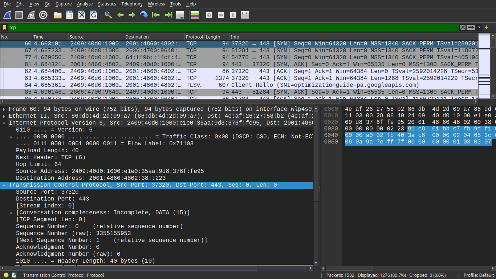
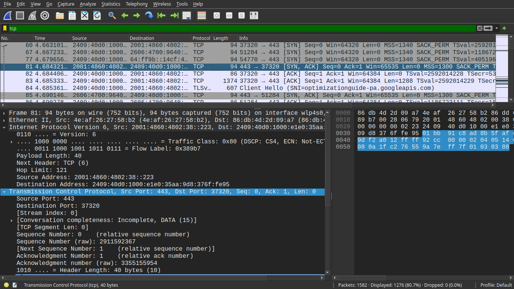
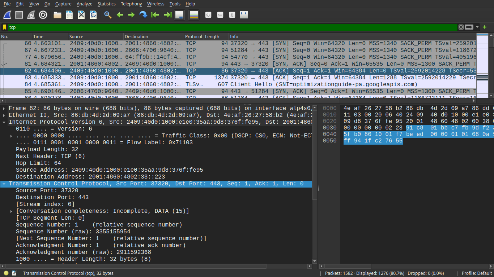

# TCP 3-Way Handshake Analysis using Wireshark

## Objective
To capture and analyze the TCP 3-way handshake process using Wireshark and understand how a connection is established between a client and server.

## Tools Used
- Wireshark
- Web Browser
- Linux System

## Steps Performed
1. Started packet capture in Wireshark
2. Opened a browser and visited example.com
3. Stopped capture after a few seconds
4. Applied filter: tcp
5. Identified TCP handshake packets

## Packet Analysis

### 1. SYN (Client → Server)
- Client initiates connection
- SYN flag is set

---

### 2. SYN-ACK (Server → Client)
- Server acknowledges request
- Sends SYN + ACK

---

### 3. ACK (Client → Server)
- Client confirms connection
- Connection established

